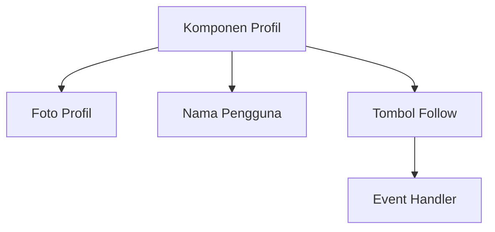
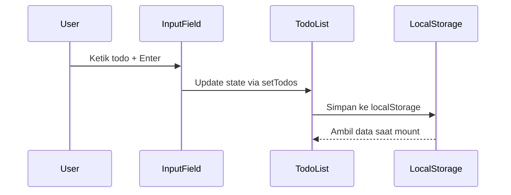
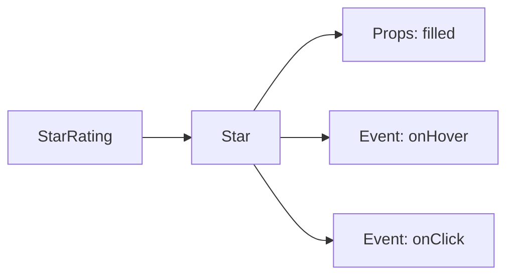
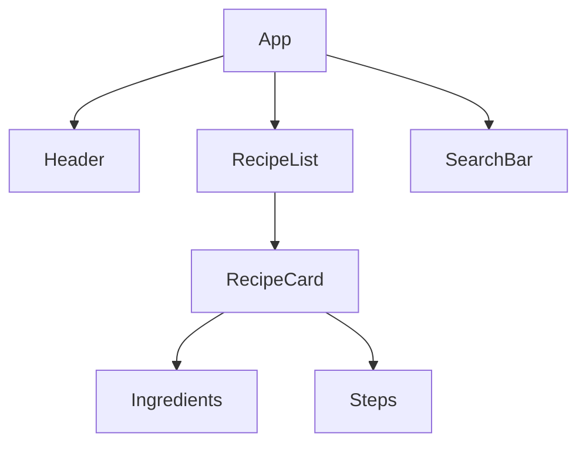

## **Januari: Fundamental React**  
### **Minggu 1: JSX & Komponen Fungsional**  


**Tugas Terstruktur:**  
1. Buat komponen `Profile` dengan JSX dasar  
2. Implementasi styling dengan CSS Modules  
3. Tambahkan efek hover pada tombol  
4. Pasang gambar lokal/remote dengan tag ``  

**Pola Kode:**  
```javascript
export default function Profile() {
  return (
    <div className={styles.card}>
      
      <h2>John Doe</h2>
      <button
        onClick={() => console.log('Followed!')}
        className={styles.followButton}
      >
        Follow
      </button>
    </div>
  );
}
```

**Best Practices:**  
- Gunakan `className` sebagai pengganti `class`  
- Pisahkan styling dengan CSS Modules  
- Gunakan arrow functions untuk handler sederhana  

---

### **Minggu 2: State & Event Handling**  


**Implementasi State:**  
```javascript
const TodoApp = () => {
  const [todos, setTodos] = useState(() => {
    const saved = localStorage.getItem('todos');
    return saved ? JSON.parse(saved) : [];
  });

  const addTodo = (text) => {
    setTodos([...todos, { id: Date.now(), text }]);
  };

  // useEffect untuk persistensi
  useEffect(() => {
    localStorage.setItem('todos', JSON.stringify(todos));
  }, [todos]);
```

**Pattern Unik:**  
- Gunakan `Date.now()` untuk ID sederhana  
- Handler untuk keyboard event:  
```javascript
const handleKeyPress = (e) => {
  if (e.key === 'Enter' && e.target.value.trim()) {
    addTodo(e.target.value.trim());
    e.target.value = '';
  }
};
```

---

### **Minggu 3: Props & Conditional Rendering**  
**Arsitektur Komponen Bintang:**  


**Implementasi Dinamis:**  
```javascript
const Star = ({ filled, onHover, onClick }) => {
  return (
    <span 
      className={`star ${filled ? 'filled' : ''}`}
      onMouseEnter={onHover}
      onClick={onClick}
    >
      {filled ? '★' : '☆'}
    </span>
  );
};

const StarRating = () => {
  const [rating, setRating] = useState(0);
  const [hover, setHover] = useState(0);

  return (
    <div>
      {[...Array(5)].map((_, i) => (
        <Star
          key={i}
          filled={i < (hover || rating)}
          onHover={() => setHover(i+1)}
          onClick={() => setRating(i+1)}
        />
      ))}
    </div>
  );
};
```

**Teknik Khusus:**  
- Array mapping untuk generate bintang  
- State ganda untuk hover dan rating aktual  
- Conditional class rendering  

---

### **Minggu 4: Mini Project - Aplikasi Resep**  
**Arsitektur Komponen:**  


**Struktur Data:**  
```javascript
const recipes = [
  {
    id: 1,
    title: "Nasi Goreng",
    ingredients: ["Nasi", "Telur", "Kecap"],
    steps: ["Panaskan minyak", "Tumis bumbu", "Masukkan nasi"]
  }
];
```

**Pola Integrasi:**  
```javascript
const RecipeApp = () => {
  const [searchTerm, setSearchTerm] = useState('');
  
  const filteredRecipes = recipes.filter(recipe =>
    recipe.title.toLowerCase().includes(searchTerm.toLowerCase())
  );

  return (
    <div>
      <SearchBar onSearch={setSearchTerm} />
      <div className="recipe-grid">
        {filteredRecipes.map(recipe => (
          <RecipeCard 
            key={recipe.id}
            title={recipe.title}
            ingredients={recipe.ingredients}
            steps={recipe.steps}
          />
        ))}
      </div>
    </div>
  );
};
```

**Fitur Tambahan:**  
- Responsive grid dengan CSS Flexbox/Grid  
- Highlight pencarian dengan regex  
- Toggle tampilan langkah/bahan  
 