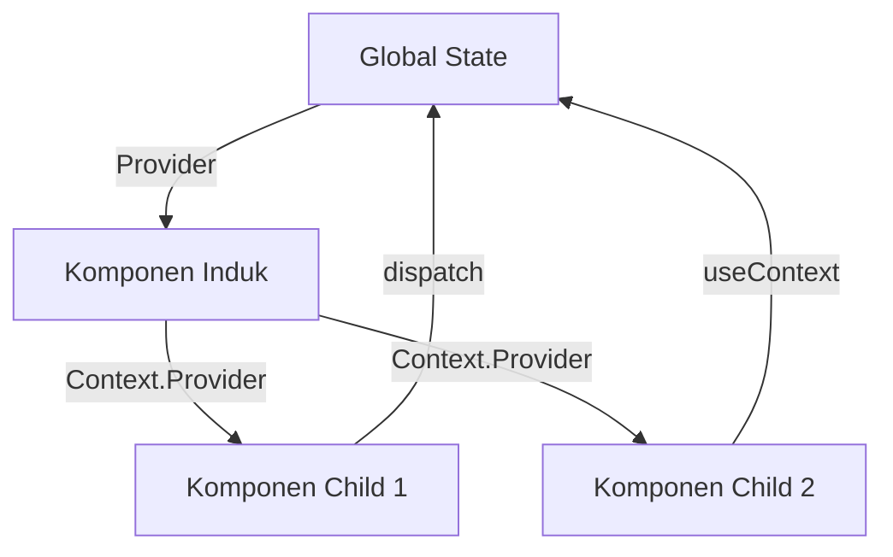
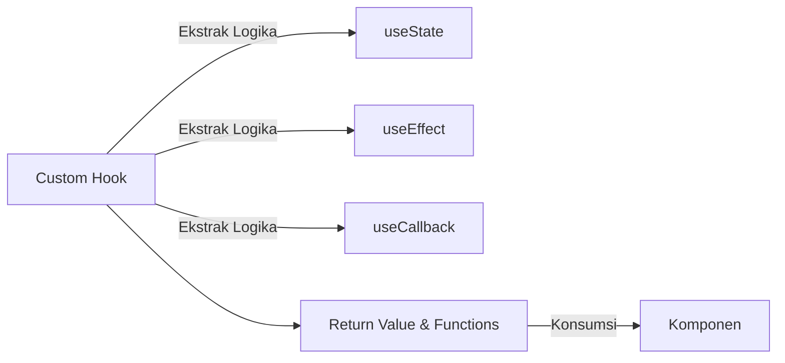
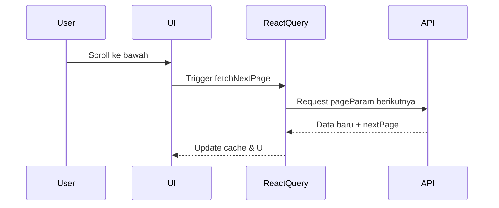
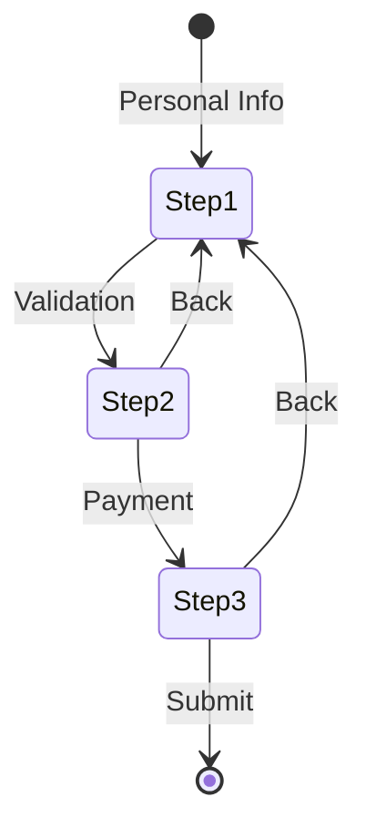

## Februari
### **Minggu 1: Context API + useReducer Deep Dive**  
#### **Arsitektur State Management**  


#### **Implementasi Terintegrasi**  
```javascript
// 1. Buat Context
const TodoContext = createContext();

// 2. Buat Reducer
const todoReducer = (state, action) => {
  switch(action.type) {
    case 'ADD_TODO':
      return { ...state, todos: [...state.todos, action.payload] }
    case 'DELETE_TODO':
      return { ...state, todos: state.todos.filter(todo => todo.id !== action.payload) }
    default:
      return state;
  }
}

// 3. Buat Provider
const TodoProvider = ({ children }) => {
  const [state, dispatch] = useReducer(todoReducer, { todos: [] });
  
  return (
    <TodoContext.Provider value={{ state, dispatch }}>
      {children}
    </TodoContext.Provider>
  );
}

// 4. Custom Hook untuk Konsumsi
const useTodo = () => {
  const context = useContext(TodoContext);
  if (!context) throw new Error('useTodo must be used within TodoProvider');
  return context;
}
```

#### **Best Practices:**
- Gunakan `useMemo` untuk value context jika sering update
- Pisahkan context berdasarkan domain (AuthContext, TodoContext, dll)
- Kombinasikan dengan `useCallback` untuk fungsi aksi yang kompleks

#### **Kasus Penggunaan Praktis:**
```javascript
// Dalam komponen TodoList
const TodoList = () => {
  const { state, dispatch } = useTodo();
  
  const handleDelete = useCallback((id) => {
    dispatch({ type: 'DELETE_TODO', payload: id });
  }, [dispatch]);
  
  return (
    <ul>
      {state.todos.map(todo => (
        <li key={todo.id}>
          {todo.text}
          <button onClick={() => handleDelete(todo.id)}>Hapus</button>
        </li>
      ))}
    </ul>
  );
}
```

---

### **Minggu 2: Custom Hooks & Performance Optimization**
#### **Arsitektur Custom Hooks**


#### **Implementasi useLocalStorage Hook**
```javascript
const useLocalStorage = (key, initialValue) => {
  // State untuk menyimpan nilai
  const [storedValue, setStoredValue] = useState(() => {
    try {
      const item = window.localStorage.getItem(key);
      return item ? JSON.parse(item) : initialValue;
    } catch (error) {
      console.error(error);
      return initialValue;
    }
  });

  // Fungsi untuk menyimpan nilai ke localStorage dan update state
  const setValue = useCallback((value) => {
    try {
      const valueToStore = 
        value instanceof Function ? value(storedValue) : value;
      setStoredValue(valueToStore);
      window.localStorage.setItem(key, JSON.stringify(valueToStore));
    } catch (error) {
      console.error(error);
    }
  }, [key, storedValue]);

  return [storedValue, setValue];
}
```

#### **Performance Optimization dengan useMemo dan useCallback**
```javascript
// Contoh useMemo untuk Kalkulasi Mahal
const ExpensiveComponent = ({ data, filter }) => {
  const filteredData = useMemo(() => {
    console.log('Filtering data...');
    return data.filter(item => item.includes(filter));
  }, [data, filter]); // Re-kalkulasi hanya jika dependencies berubah
  
  return (
    <ul>
      {filteredData.map(item => <li key={item}>{item}</li>)}
    </ul>
  );
}

// Contoh useCallback untuk Event Handlers
const ParentComponent = () => {
  const [count, setCount] = useState(0);
  
  const handleIncrement = useCallback(() => {
    setCount(c => c + 1);
  }, []); // Fungsi tidak berubah pada setiap render
  
  return <ChildButton onClick={handleIncrement} />;
}

// React.memo untuk skip render yang tidak perlu
const ChildButton = React.memo(({ onClick }) => {
  console.log('Child rendered');
  return <button onClick={onClick}>Increment</button>;
});
```

#### **Custom Hook Praktis: useDebounce**
```javascript
const useDebounce = (value, delay) => {
  const [debouncedValue, setDebouncedValue] = useState(value);
  
  useEffect(() => {
    const timer = setTimeout(() => {
      setDebouncedValue(value);
    }, delay);
    
    return () => {
      clearTimeout(timer);
    };
  }, [value, delay]);
  
  return debouncedValue;
}

// Penggunaan dalam komponen
const SearchComponent = () => {
  const [search, setSearch] = useState('');
  const debouncedSearch = useDebounce(search, 500);
  
  useEffect(() => {
    // API call with debouncedSearch
    if (debouncedSearch) fetchResults(debouncedSearch);
  }, [debouncedSearch]);
  
  return (
    <input 
      type="text" 
      value={search}
      onChange={(e) => setSearch(e.target.value)}
      placeholder="Search..."
    />
  );
}
```

#### **Best Practices for Custom Hooks:**
- Gunakan awalan "use" untuk semua custom hooks
- Pastikan hooks tidak memiliki side effects luar biasa
- Dokumentasikan parameters dan return values
- Uji hooks secara terpisah dengan React Testing Library

---

### **Minggu 3: React Query & useInfiniteQuery Pattern**  
#### **Arsitektur Infinite Scroll**  


#### **Implementasi dengan Zod Validation**  
```javascript
import { useInfiniteQuery } from '@tanstack/react-query';
import { z } from 'zod';

// 1. Definisikan Schema Response
const NewsSchema = z.object({
  articles: z.array(
    z.object({
      title: z.string(),
      url: z.string().url(),
      publishedAt: z.string().datetime()
    })
  ),
  totalResults: z.number()
});

// 2. Fetch Function dengan Validasi
const fetchNews = async ({ pageParam = 1 }) => {
  const res = await fetch(`https://newsapi.org/v2/everything?page=${pageParam}`);
  const data = await res.json();
  return NewsSchema.parse(data); // Validasi dengan Zod
}

// 3. Implementasi Infinite Query
const { data, fetchNextPage, hasNextPage } = useInfiniteQuery(
  ['news'],
  fetchNews,
  {
    getNextPageParam: (lastPage, allPages) => {
      const maxPages = Math.ceil(lastPage.totalResults / 20);
      return allPages.length < maxPages ? allPages.length + 1 : undefined;
    }
  }
);
```

#### **Implementasi Komponen InfiniteScroll**
```javascript
import { useEffect, useRef, useCallback } from 'react';

const NewsInfiniteList = () => {
  const { 
    data, 
    fetchNextPage, 
    hasNextPage, 
    isFetchingNextPage 
  } = useNewsInfiniteQuery();
  
  const observer = useRef();
  const lastElementRef = useCallback(node => {
    if (isFetchingNextPage) return;
    
    if (observer.current) observer.current.disconnect();
    
    observer.current = new IntersectionObserver(entries => {
      if (entries[0].isIntersecting && hasNextPage) {
        fetchNextPage();
      }
    });
    
    if (node) observer.current.observe(node);
  }, [isFetchingNextPage, fetchNextPage, hasNextPage]);
  
  return (
    <div className="news-container">
      {data?.pages.map((page, i) => (
        <React.Fragment key={i}>
          {page.articles.map((article, index) => (
            <div 
              key={article.url}
              ref={
                i === data.pages.length - 1 && 
                index === page.articles.length - 1 
                ? lastElementRef : null
              }
              className="news-card"
            >
              <h2>{article.title}</h2>
              <p>{new Date(article.publishedAt).toLocaleDateString()}</p>
              <a href={article.url} target="_blank" rel="noopener noreferrer">
                Read More
              </a>
            </div>
          ))}
        </React.Fragment>
      ))}
      {isFetchingNextPage && <div className="loading">Loading more...</div>}
    </div>
  );
};
```

#### **Optimasi Performa:**
- Gunakan `initialData` untuk server-side rendering
- Implementasi `staleTime` sesuai kebutuhan update data
- Gunakan `keepPreviousData` untuk transisi halus antar halaman

---

### **Minggu 4: Form Handling dengan Zod**  
#### **Validasi Multi-Step**  
```javascript
import { useForm } from 'react-hook-form';
import { zodResolver } from '@hookform/resolvers/zod';

// 1. Buat Schema Validasi
const RegistrationSchema = z.object({
  email: z.string().email('Format email tidak valid'),
  password: z.string()
    .min(8, 'Minimal 8 karakter')
    .regex(/[A-Z]/, 'Harus mengandung huruf besar'),
  confirmPassword: z.string()
}).refine(data => data.password === data.confirmPassword, {
  message: 'Password tidak sama',
  path: ['confirmPassword']
});

// 2. Integrasi dengan React Hook Form
const { register, handleSubmit, formState: { errors } } = useForm({
  resolver: zodResolver(RegistrationSchema)
});

// 3. Tampilan Error
{errors.email && (
  <p className="text-red-500">{errors.email.message}</p>
)}
```

#### **Pattern Multi-Step Form**  


#### **Implementasi Multi-Step Form dengan Zod**
```javascript
import { useState } from 'react';
import { useForm } from 'react-hook-form';
import { zodResolver } from '@hookform/resolvers/zod';
import { z } from 'zod';

// Schema untuk masing-masing langkah
const personalInfoSchema = z.object({
  name: z.string().min(2, 'Nama minimal 2 karakter'),
  email: z.string().email('Email tidak valid')
});

const addressSchema = z.object({
  address: z.string().min(5, 'Alamat terlalu pendek'),
  city: z.string().min(2, 'Kota tidak valid'),
  postalCode: z.string().regex(/^\d{5}$/, 'Kode pos harus 5 digit')
});

const paymentSchema = z.object({
  cardNumber: z.string().regex(/^\d{16}$/, 'Nomor kartu harus 16 digit'),
  expiry: z.string().regex(/^\d{2}\/\d{2}$/, 'Format kadaluarsa: MM/YY'),
  cvv: z.string().regex(/^\d{3}$/, 'CVV harus 3 digit')
});

// Komponen Multi-step form
const MultiStepForm = () => {
  const [step, setStep] = useState(0);
  const [formData, setFormData] = useState({});
  
  // Gunakan schema yang sesuai dengan langkah saat ini
  const currentSchema = [
    personalInfoSchema, 
    addressSchema, 
    paymentSchema
  ][step];
  
  const { register, handleSubmit, formState: { errors } } = useForm({
    resolver: zodResolver(currentSchema),
    defaultValues: formData
  });
  
  // Handler untuk langkah selanjutnya
  const onSubmit = data => {
    const updatedData = { ...formData, ...data };
    setFormData(updatedData);
    
    if (step < 2) {
      setStep(step + 1);
    } else {
      // Proses submit data final
      console.log('Form submitted:', updatedData);
      // submitToServer(updatedData);
    }
  };
  
  // Handler untuk kembali ke langkah sebelumnya
  const handleBack = () => {
    if (step > 0) {
      setStep(step - 1);
    }
  };
  
  // Render konten form berdasarkan langkah
  const renderStepContent = () => {
    switch (step) {
      case 0:
        return (
          <>
            <h2>Personal Information</h2>
            <input 
              {...register('name')} 
              placeholder="Nama Lengkap" 
            />
            {errors.name && <p className="error">{errors.name.message}</p>}
            
            <input 
              {...register('email')} 
              placeholder="Email" 
            />
            {errors.email && <p className="error">{errors.email.message}</p>}
          </>
        );
      case 1:
        return (
          <>
            <h2>Address</h2>
            <textarea 
              {...register('address')} 
              placeholder="Alamat" 
            />
            {errors.address && <p className="error">{errors.address.message}</p>}
            
            <input 
              {...register('city')} 
              placeholder="Kota" 
            />
            {errors.city && <p className="error">{errors.city.message}</p>}
            
            <input 
              {...register('postalCode')} 
              placeholder="Kode Pos" 
            />
            {errors.postalCode && <p className="error">{errors.postalCode.message}</p>}
          </>
        );
      case 2:
        return (
          <>
            <h2>Payment Details</h2>
            <input 
              {...register('cardNumber')} 
              placeholder="Nomor Kartu" 
            />
            {errors.cardNumber && <p className="error">{errors.cardNumber.message}</p>}
            
            <input 
              {...register('expiry')} 
              placeholder="MM/YY" 
            />
            {errors.expiry && <p className="error">{errors.expiry.message}</p>}
            
            <input 
              {...register('cvv')} 
              placeholder="CVV" 
            />
            {errors.cvv && <p className="error">{errors.cvv.message}</p>}
          </>
        );
      default:
        return null;
    }
  };
  
  return (
    <form onSubmit={handleSubmit(onSubmit)}>
      {/* Progress indicator */}
      <div className="progress-bar">
        <div className={`step ${step >= 0 ? 'active' : ''}`}>1</div>
        <div className={`step ${step >= 1 ? 'active' : ''}`}>2</div>
        <div className={`step ${step >= 2 ? 'active' : ''}`}>3</div>
      </div>
      
      {renderStepContent()}
      
      <div className="buttons">
        {step > 0 && (
          <button type="button" onClick={handleBack}>
            Back
          </button>
        )}
        <button type="submit">
          {step === 2 ? 'Submit' : 'Next'}
        </button>
      </div>
    </form>
  );
};
```

---

### **Konsep Inti Kombinasi useContext + useReducer**  
1. **Single Source of Truth**  
- State global disimpan dalam 1 tempat (context)
- Perubahan hanya melalui `dispatch` function

2. **Predictable State Updates**  
- Reducer sebagai state transition manager
- Aksi didefinisikan sebagai objek `{ type: 'ACTION_NAME', payload }`

3. **Performance Optimization**  
- Memoisasi komponen dengan `React.memo`
- Split context untuk update granular

4. **Debugging**  
- Trace perubahan state dengan Redux DevTools:  
```javascript
const todoReducer = (state, action) => {
  // ...
  if (typeof window !== 'undefined') {
    window.__REDUX_DEVTOOLS_EXTENSION__?.send(action, state);
  }
  return newState;
}
```

5. **Type Safety**  
- Gunakan TypeScript untuk definisi aksi:  
```typescript
type TodoAction = 
  | { type: 'ADD_TODO'; payload: Todo }
  | { type: 'DELETE_TODO'; payload: string };
```

