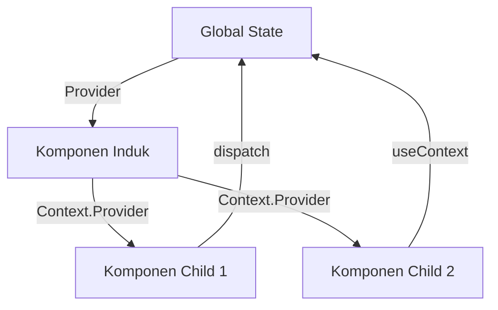
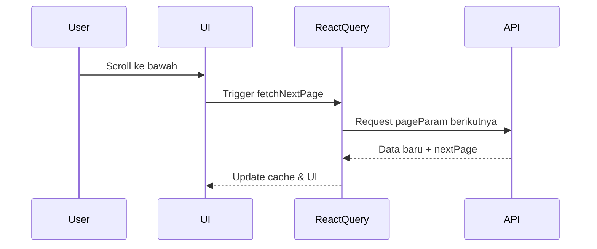
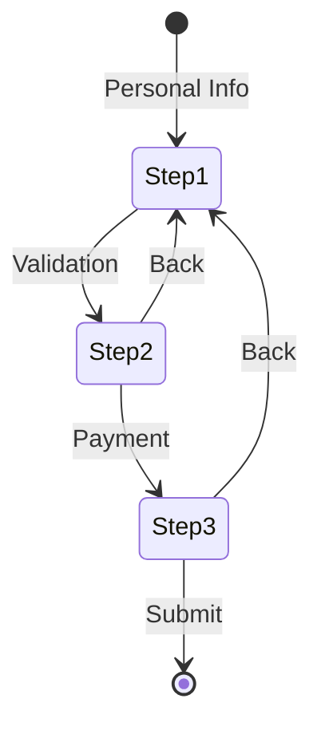

## Februari
### **Minggu 1: Context API + useReducer Deep Dive**  
#### **Arsitektur State Management**  


#### **Implementasi Terintegrasi**  
```javascript
// 1. Buat Context
const TodoContext = createContext();

// 2. Buat Reducer
const todoReducer = (state, action) => {
  switch(action.type) {
    case 'ADD_TODO':
      return { ...state, todos: [...state.todos, action.payload] }
    case 'DELETE_TODO':
      return { ...state, todos: state.todos.filter(todo => todo.id !== action.payload) }
    default:
      return state;
  }
}

// 3. Buat Provider
const TodoProvider = ({ children }) => {
  const [state, dispatch] = useReducer(todoReducer, { todos: [] });
  
  return (
    <TodoContext.Provider value={{ state, dispatch }}>
      {children}
    </TodoContext.Provider>
  );
}

// 4. Custom Hook untuk Konsumsi
const useTodo = () => {
  const context = useContext(TodoContext);
  if (!context) throw new Error('useTodo must be used within TodoProvider');
  return context;
}
```

#### **Best Practices:**
- Gunakan `useMemo` untuk value context jika sering update
- Pisahkan context berdasarkan domain (AuthContext, TodoContext, dll)
- Kombinasikan dengan `useCallback` untuk fungsi aksi yang kompleks

---

### **Minggu 3: React Query & useInfiniteQuery Pattern**  
#### **Arsitektur Infinite Scroll**  


#### **Implementasi dengan Zod Validation**  
```javascript
import { useInfiniteQuery } from '@tanstack/react-query';
import { z } from 'zod';

// 1. Definisikan Schema Response
const NewsSchema = z.object({
  articles: z.array(
    z.object({
      title: z.string(),
      url: z.string().url(),
      publishedAt: z.string().datetime()
    })
  ),
  totalResults: z.number()
});

// 2. Fetch Function dengan Validasi
const fetchNews = async ({ pageParam = 1 }) => {
  const res = await fetch(`https://newsapi.org/v2/everything?page=${pageParam}`);
  const data = await res.json();
  return NewsSchema.parse(data); // Validasi dengan Zod
}

// 3. Implementasi Infinite Query
const { data, fetchNextPage, hasNextPage } = useInfiniteQuery(
  ['news'],
  fetchNews,
  {
    getNextPageParam: (lastPage, allPages) => {
      const maxPages = Math.ceil(lastPage.totalResults / 20);
      return allPages.length < maxPages ? allPages.length + 1 : undefined;
    }
  }
);
```

#### **Optimasi Performa:**
- Gunakan `initialData` untuk server-side rendering
- Implementasi `staleTime` sesuai kebutuhan update data
- Gunakan `keepPreviousData` untuk transisi halus antar halaman

---

### **Minggu 4: Form Handling dengan Zod**  
#### **Validasi Multi-Step**  
```javascript
import { useForm } from 'react-hook-form';
import { zodResolver } from '@hookform/resolvers/zod';

// 1. Buat Schema Validasi
const RegistrationSchema = z.object({
  email: z.string().email('Format email tidak valid'),
  password: z.string()
    .min(8, 'Minimal 8 karakter')
    .regex(/[A-Z]/, 'Harus mengandung huruf besar'),
  confirmPassword: z.string()
}).refine(data => data.password === data.confirmPassword, {
  message: 'Password tidak sama',
  path: ['confirmPassword']
});

// 2. Integrasi dengan React Hook Form
const { register, handleSubmit, formState: { errors } } = useForm({
  resolver: zodResolver(RegistrationSchema)
});

// 3. Tampilan Error
{errors.email && (
  <p className="text-red-500">{errors.email.message}</p>
)}
```

#### **Pattern Multi-Step Form**  


---

### **Konsep Inti Kombinasi useContext + useReducer**  
1. **Single Source of Truth**  
- State global disimpan dalam 1 tempat (context)
- Perubahan hanya melalui `dispatch` function

2. **Predictable State Updates**  
- Reducer sebagai state transition manager
- Aksi didefinisikan sebagai objek `{ type: 'ACTION_NAME', payload }`

3. **Performance Optimization**  
- Memoisasi komponen dengan `React.memo`
- Split context untuk update granular

4. **Debugging**  
- Trace perubahan state dengan Redux DevTools:  
```javascript
const todoReducer = (state, action) => {
  // ...
  if (typeof window !== 'undefined') {
    window.__REDUX_DEVTOOLS_EXTENSION__?.send(action, state);
  }
  return newState;
}
```

5. **Type Safety**  
- Gunakan TypeScript untuk definisi aksi:  
```typescript
type TodoAction = 
  | { type: 'ADD_TODO'; payload: Todo }
  | { type: 'DELETE_TODO'; payload: string };
```

 