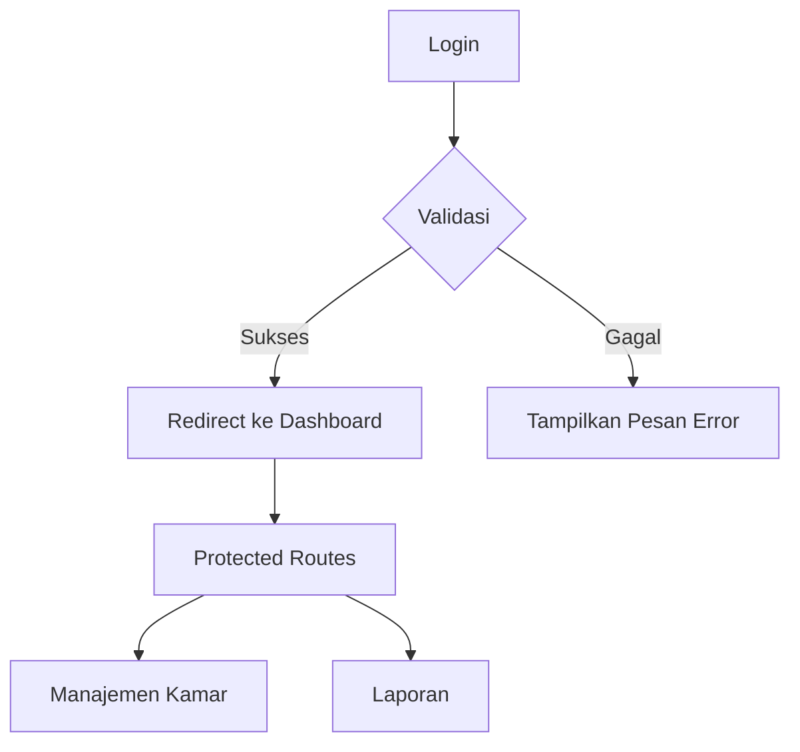
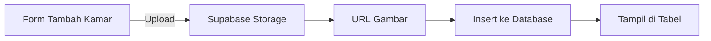
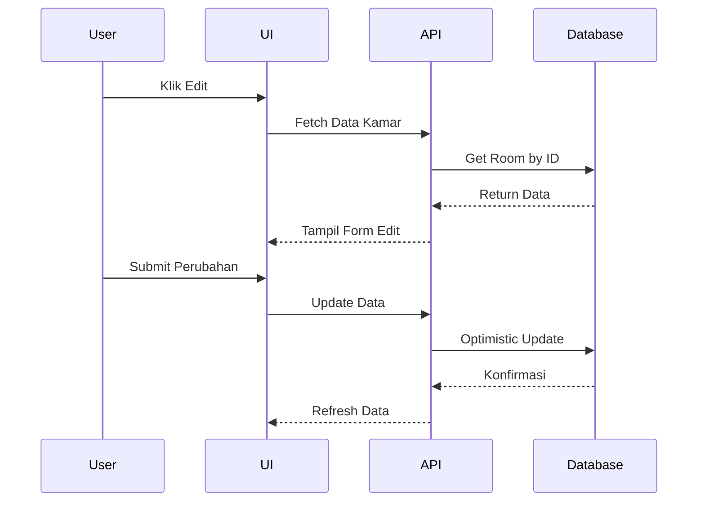
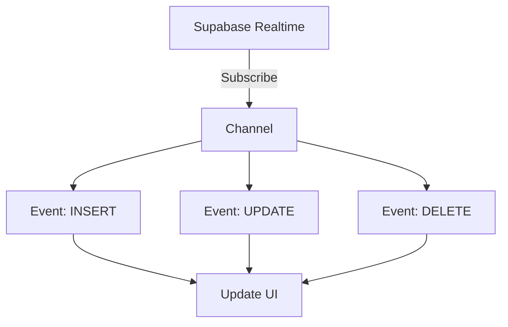

Berikut ekspansi detail untuk rencana pembelajaran Maret dengan diagram MermaidJS, pola kode, dan praktik terbaik:

---

### **Maret: Aplikasi Hotel - Foundation**  
#### **Minggu 1: Setup Proyek & Autentikasi**  


**Implementasi Auth:**  
```javascript
// Supabase Client Setup
import { createClient } from '@supabase/supabase-js'

const supabase = createClient(
  import.meta.env.VITE_SUPABASE_URL,
  import.meta.env.VITE_SUPABASE_KEY
)

// Login Handler
const handleLogin = async (email, password) => {
  const { data, error } = await supabase.auth.signInWithPassword({
    email,
    password
  })
  
  if(error) throw new Error(error.message)
  return data
}

// Protected Route Component
const ProtectedRoute = ({ children }) => {
  const [user] = useAuthState()
  
  return user ? children : <Navigate to="/login" />
}
```

**Best Practices:**  
1. Simpan session user di context/provider  
2. Gunakan refresh token untuk maintain session  
3. Implementasi idle timeout setelah 30 menit  

---

#### **Minggu 2: Manajemen Kamar (CRUD Dasar)**  


**Pola Upload Gambar:**  
```javascript
const uploadImage = async (file) => {
  const fileName = `${Date.now()}-${file.name}`
  
  const { data, error } = await supabase.storage
    .from('room-images')
    .upload(fileName, file)

  if(error) throw new Error('Upload gagal')
  return data.path
}

// Schema Validasi dengan Zod
const RoomSchema = z.object({
  name: z.string().min(3),
  price: z.number().positive(),
  capacity: z.number().int().positive()
})
```

**Optimasi Tabel:**  
1. Virtual scrolling untuk data besar  
2. Server-side pagination  
3. Client-side sorting dengan `order` Supabase  
```javascript
const { data } = await supabase
  .from('rooms')
  .select('*')
  .order('created_at', { ascending: false })
```

---

#### **Minggu 3: Advanced CRUD Operations**  


**Implementasi Optimistic Update:**  
```javascript
const updateRoom = async (id, updates) => {
  setRooms(prev => prev.map(room => 
    room.id === id ? { ...room, ...updates } : room
  ))
  
  const { error } = await supabase
    .from('rooms')
    .update(updates)
    .eq('id', id)

  if(error) {
    // Rollback perubahan
    setRooms(originalData)
    throw error
  }
}
```

**Konfirmasi Delete:**  
```javascript
const DeleteModal = ({ roomId, onConfirm }) => {
  const [isOpen, setIsOpen] = useState(false)

  return (
    <>
      <button onClick={() => setIsOpen(true)}>Hapus</button>
      
      <Dialog open={isOpen}>
        <h3>Konfirmasi Hapus</h3>
        <p>Yakin ingin menghapus kamar ini?</p>
        <button onClick={() => {
          onConfirm(roomId)
          setIsOpen(false)
        }}>Ya</button>
        <button onClick={() => setIsOpen(false)}>Batal</button>
      </Dialog>
    </>
  )
}
```

---

#### **Minggu 4: Real-time Updates**  


**Implementasi Subscribtion:**  
```javascript
useEffect(() => {
  const channel = supabase
    .channel('rooms')
    .on('postgres_changes', {
      event: '*',
      schema: 'public',
      table: 'rooms'
    }, (payload) => {
      switch(payload.eventType) {
        case 'INSERT':
          setRooms(prev => [...prev, payload.new])
          break
        case 'UPDATE':
          setRooms(prev => prev.map(room => 
            room.id === payload.new.id ? payload.new : room
          ))
          break
        case 'DELETE':
          setRooms(prev => prev.filter(room => 
            room.id !== payload.old.id
          ))
          break
      }
    })
    .subscribe()

  return () => {
    supabase.removeChannel(channel)
  }
}, [])
```

**Optimasi Real-time:**  
1. Gunakan debounce untuk update yang cepat  
2. Batasi update hanya untuk kolom tertentu  
3. Tambahkan indikator status real-time  
```javascript
const [connectionStatus, setConnectionStatus] = useState('connecting')

channel.on('broadcast', { event: 'status' }, ({ status }) => {
  setConnectionStatus(status)
})
```

---

### **Best Practices Keseluruhan**  
1. **Security:**  
- Row Level Security di Supabase  
- Validasi input server-side  
- Batasi akses storage dengan bucket policies  

2. **Error Handling:**  
```javascript
const handleError = (error) => {
  if(error.code === '23505') {
    return 'Nama kamar sudah terdaftar'
  }
  return error.message
}
```

3. **Testing:**  
- Mock Supabase client untuk unit test  
- End-to-end test dengan Cypress  
- Load test untuk real-time updates  

4. **Referensi:**  
- [Supabase Realtime Docs](https://supabase.com/docs/guides/realtime)  
- [Optimistic UI Patterns](https://redux.js.org/usage/optimistic-updates)  
- [PostgreSQL Row Level Security](https://supabase.com/docs/guides/auth/row-level-security)  
