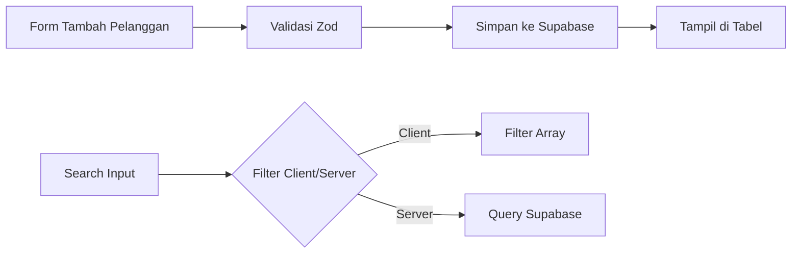
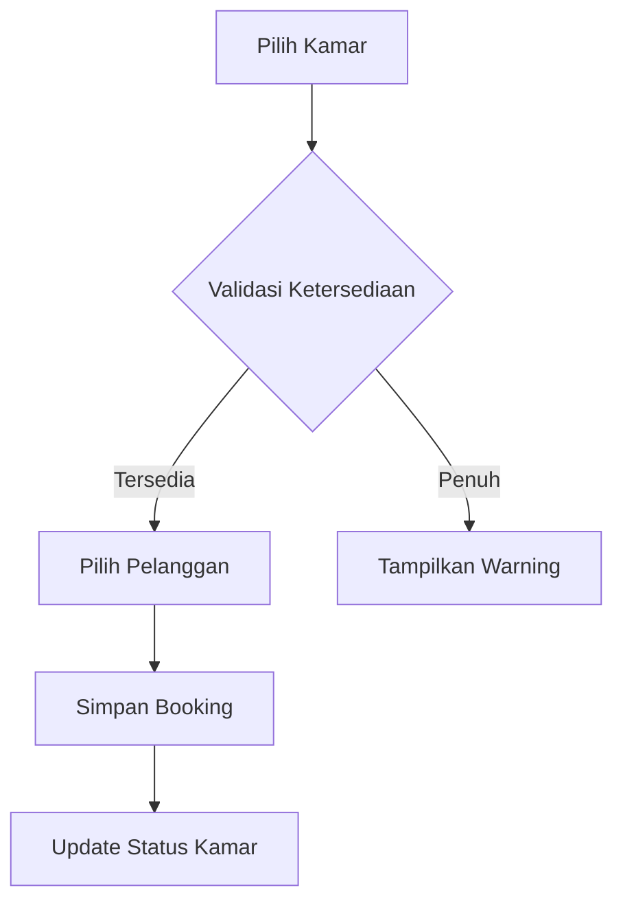
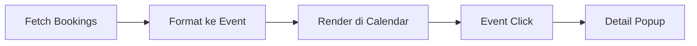
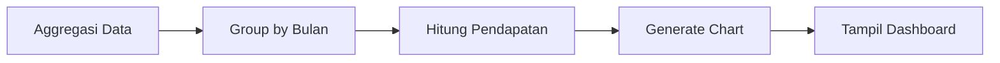

### **April: Aplikasi Hotel - Pelanggan & Booking**

#### **Minggu 1: Manajemen Pelanggan**



**Implementasi Pencarian Hybrid:**

```javascript
const searchCustomers = async (term) => {
  if (term.length < 3) return clientSideFilter(term);

  const { data } = await supabase
    .from("customers")
    .select()
    .textSearch("fts", `${term}`, { config: "indonesian" });

  return data;
};

// Schema Validasi
const CustomerSchema = z.object({
  nik: z.string().length(16),
  name: z.string().min(3),
  phone: z.string().regex(/^08\d{9,11}$/),
});
```

**Pattern Unik:**

- Full-Text Search dengan PostgreSQL
- Auto-suggest menggunakan Combobox
- Duplikasi data untuk offline search (indexedDB)

---

#### **Minggu 2: Sistem Booking Dasar**



**Relasi Data dengan Supabase:**

```javascript
const createBooking = async (data) => {
  const { error } = await supabase
    .from("bookings")
    .insert({
      room_id: data.room.id,
      customer_id: data.customer.id,
      check_in: data.dates.start,
      check_out: data.dates.end,
    })
    .select("*, room(*), customer(*)");

  return { error };
};

// Query Relasional
const getBookings = () =>
  supabase.from("bookings").select(`
    id,
    check_in,
    check_out,
    rooms ( name, price ),
    customers ( name, phone )
  `);
```

**Best Practices:**

1. Gunakan transaksi untuk operasi terkait
2. Batasi pemilihan tanggal dengan `disabledDate`
3. Optimalkan query dengan eager loading

---

#### **Minggu 3: Kalender Interaktif**



**Integrasi react-big-calendar:**

```javascript
import { Calendar, momentLocalizer } from 'react-big-calendar'
import moment from 'moment'

const localizer = momentLocalizer(moment)

const formatEvents = (bookings) =>
  bookings.map(b => ({
    title: `#${b.id} - ${b.rooms.name}`,
    start: new Date(b.check_in),
    end: new Date(b.check_out),
    resource: b
  }))

<Calendar
  localizer={localizer}
  events={events}
  onSelectEvent={handleSelect}
  style={{ height: 600 }}
/>
```

**Fitur Tambahan:**

- Drag & drop untuk ubah tanggal
- Overlay konflik booking
- Visualisasi kamar dengan color coding

---

#### **Minggu 4: Laporan Pendapatan**



**Query Aggregasi:**

```javascript
const getMonthlyRevenue = async () => {
  const { data } = await supabase
    .from("bookings")
    .select(
      `
      check_in,
      rooms ( price )
    `
    )
    .gte("check_in", startDate)
    .lte("check_in", endDate);

  const monthlyData = data.reduce((acc, curr) => {
    const month = moment(curr.check_in).format("MMM YYYY");
    acc[month] = (acc[month] || 0) + curr.rooms.price;
    return acc;
  }, {});

  return monthlyData;
};
```

**Visualisasi dengan Chart.js:**

```javascript
const options = {
  plugins: {
    annotation: {
      annotations: {
        avgLine: {
          type: 'line',
          yMin: average,
          yMax: average,
          borderColor: 'red',
          borderDash: [5, 5]
        }
      }
    }
  }
}

<Bar
  data={{ labels: months, datasets: [/* ... */] }}
  options={options}
/>
```

---

### **Best Practices Keseluruhan**

1. **Optimasi Performa:**

- Server-side pagination untuk data besar
- Cache strategis dengan SWR
- Virtualisasi tabel menggunakan react-window

2. **Error Handling:**

```javascript
const { data, error } = await supabaseQuery();
if (error) {
  if (error.code === "PGRST204") return; // No data
  throw new Error(error.message);
}
```

3. **Security:**

- Row Level Security untuk akses data
- Validasi server-side dengan PostgreSQL triggers
- Enkripsi data sensitif (NIK, nomor telepon)

4. **Referensi:**

- [Advanced Chart.js Config](https://www.chartjs.org/docs/latest/)
- [Big Calendar Customization](http://jquense.github.io/react-big-calendar/)
- [Supabase RLS Guide](https://supabase.com/docs/guides/auth/row-level-security)
